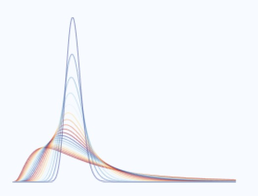

```{r, include=FALSE}
knitr::opts_chunk$set(
  results='asis', 
  echo = FALSE,
  warning=FALSE,
  message=FALSE
)

library(magrittr) # For the pipe
source("CV_printing_functions.R")

# Read in all data and initialize a CV printer object
CV <- create_CV_object(
  data_location = "/Users/yasha/Desktop/Data_Science/My_CV/Resume/CSVs/",  
  pdf_mode = params$pdf_mode
)

```


```{r}
# When in pdf export mode the little dots are unaligned, so fix that with some conditional CSS.
if(params$pdf_mode) {
    cat("
<style>
:root{
  --decorator-outer-offset-left: -6.5px;
}
</style>")
}
```


Aside
================================================================================

{width=100%}

```{r}
#cat("These graphs are from one of my publications") 
```


```{r}
# Build interactive network of positions colored by section
# and connected if they occurred in the same year
#datadrivencv::build_network_logo(CV$entries_data)
```


```{r}

if(params$pdf_mode){
  cat("View this resume online with links at www.jamesgammerman.com/resume")
} else {
  cat("[<i class='fas fa-download'></i> Download a PDF of this CV](https://www.jamesgammerman.com/cv)")
}
```

Contact {#contact}
--------------------------------------------------------------------------------

```{r}
CV %>% print_contact_info()
```


Language Skills {#skills}
--------------------------------------------------------------------------------

```{r}
CV %>% print_skill_bars()
```


More info {#more-info}
--------------------------------------------------------------------------------

See full CV at www.jamesgammerman.com/cv for more complete list of positions and accomplishments.


<!-- Other Skills {#other} -->
<!-- -------------------------------------------------------------------------------- -->
<!-- <br> -->
<!-- * Tensorflow/Keras -->
<!-- * Microsoft Azure -->
<!-- * AWS -->
<!-- * Spark -->


Main
================================================================================

James Gammerman {#title}
--------------------------------------------------------------------------------

```{r}
# # Note the special double pipe so we modify the CV object in place
# CV %<>% print_text_block("intro") 
```


Education {data-icon=graduation-cap data-concise=true}
--------------------------------------------------------------------------------

```{r}
CV %<>% print_section('education')
```


Professional Experience {data-icon=suitcase}
--------------------------------------------------------------------------------


```{r}
CV %<>% print_section('industry_positions')
```


Academic Publications {data-icon=book}
--------------------------------------------------------------------------------

```{r}
CV %<>% print_section('academic_articles')
```


Talks and Teaching {data-icon=chalkboard-teacher}
--------------------------------------------------------------------------------

```{r}
CV %<>% print_section('talks_and_teaching')
```

